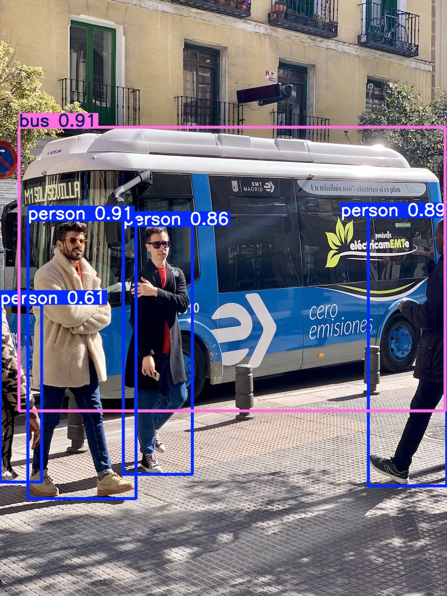

# YOLOv8

```shell
$ git clone https://github.com/ultralytics/ultralytics.git
$ cd ultralytics/
$ git checkout -b v8.2.103 v8.2.103

commit 25307552100e4c03c8fec7b0f7286b4244018e15 (HEAD -> v8.2.103, tag: v8.2.103)
Author: Glenn Jocher <glenn.jocher@ultralytics.com>
Date:   Sat Sep 28 20:31:21 2024 +0200
```

## Usage

```shell
# Use NumPy for Pre/Post-processing
python3 samples/yolov8/infer.py models/yolov8s.onnx assets/bus.jpg core/cfgs/coco.yaml

# Use PyTorch for Pre/Post-processing
python3 samples/yolov8/infer.py models/yolov8s.onnx assets/bus.jpg core/cfgs/coco.yaml --processor torch

# Use TensorRT for infer
python3 samples/yolov8/infer.py models/yolov8s_fp16.engine assets/bus.jpg core/cfgs/coco.yaml --backend tensorrt

# Use Triton to infer
python3 samples/yolov8/infer.py DET_YOLOv8s_ONNX assets core/cfgs/coco.yaml --backend triton
python3 samples/yolov8/infer.py DET_YOLOv8s_TensorRT assets core/cfgs/coco.yaml --backend triton
```

